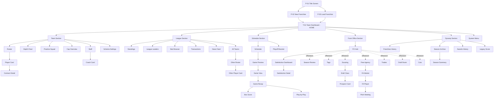

# Step 1 — Information Architecture

**Status**: Drafted, pending review.
**Purpose**: Map every screen the game needs and how they connect, before any wireframing or coding. This is the navigation backbone Claude Code will implement against in Phase 5.
**Inputs to this step**: CLAUDE.md project structure, GDD Layers 1-3, Phases 0-3 systems already built.
**Output of this step**: Sitemap, screen inventory, navigation rules, validated user flows.

---

## Design Principles (Inherited)

1. **Hub-and-spoke navigation** with the **Team Dashboard** as the home base.
2. **Two-click rule** for primary screens, three-click maximum for detail drill-downs. No common task should require more.
3. **Persistent context** (week, team, cap, season phase) visible on every screen except the Main Menu — detailed in Step 2.
4. **Mode-aware sections**: top-level navigation stays constant, but the active content inside "Front Office" and "Schedule" swaps based on whether you're in-season, playoffs, or offseason.
5. **Read-only first**: every screen must work as a viewer before any actions are wired. Action affordances are layered on, never built into the navigation backbone.
6. **Letter grades only** in any displayed rating (per CLAUDE.md). UI never sees raw `true_overall`.

---

## Top-Level Navigation

Five sections visible at all times once a franchise is loaded. Implementation will be a left sidebar (recommended) or top tab bar — the choice happens in Step 3 (wireframes), not here.

| Section | Always visible? | Content swaps by phase? |
|---|---|---|
| **Team** | Yes | No |
| **League** | Yes | No (table contents update) |
| **Schedule** | Yes | Yes (regular season → playoffs → off-season placeholder) |
| **Front Office** | Yes | Yes (in-season ops → offseason phases) |
| **Dynasty** | Yes | No |
| **System** | Yes (corner/menu) | No |

The Team Dashboard inside Team is the home base — every section's "home" link returns there.

---

## Complete Screen Inventory

Screens are grouped by section. Click depth shown as `(D)` where D is clicks from Team Dashboard.

### 0. Pre-Franchise (no save loaded)

| ID | Screen | Type | Notes |
|---|---|---|---|
| P-01 | Title Screen / Main Menu | Utility | Entry point. New / Load / Settings / Quit |
| P-02 | New Franchise Setup | Utility | Pick team, season year, difficulty |
| P-03 | Load Franchise | Utility | List `saves/*.db` files |
| P-04 | Settings | Utility | Audio, display, autosave |
| P-05 | Help / Glossary | Utility | Onboarding, terminology |

### 1. Team

| ID | Screen | Depth | Type | Source Tables |
|---|---|---|---|---|
| T-01 | **Team Dashboard** (home) | (0) | Hub | `team`, `transaction_log`, `satisfaction_event` |
| T-02 | Roster Overview | (1) | List | `player`, `contract` |
| T-03 | Depth Chart | (1) | Editor | `player`, position groupings |
| T-04 | Practice Squad | (1) | List | `player` (PS flag) |
| T-05 | Player Card | (2) | Detail | `player`, `box_score`, `player_season_stats`, `player_career_stats`, `contract_year`, `satisfaction_event` |
| T-06 | Contract Detail | (3) | Detail | `contract`, `contract_year` |
| T-07 | Salary Cap Overview | (1) | Hub | `team.cap_space`, `contract_year` (current year) |
| T-08 | Coaching Staff | (1) | List | `staff` |
| T-09 | Coach Card | (2) | Detail | `staff`, scheme fit data |
| T-10 | Scheme Settings | (1) | Editor | `team.scheme_offense`, `team.scheme_defense` |

### 2. League

| ID | Screen | Depth | Type | Source Tables |
|---|---|---|---|---|
| L-01 | League Hub | (1) | Hub | landing for league section |
| L-02 | Standings — Division | (1) | List | `team`, `team_season_stats` |
| L-03 | Standings — Conference | (1) | List | same |
| L-04 | Power Rankings | (1) | List | computed |
| L-05 | League Leaders | (1) | List | `player_season_stats` aggregated |
| L-06 | Stat Browser | (2) | Filtered list | `player_season_stats`, `player_career_stats` |
| L-07 | Transactions Log | (1) | Feed | `transaction_log` |
| L-08 | News Feed | (1) | Feed | computed storylines, satisfaction events |
| L-09 | All Teams Browser | (1) | List | `team` |
| L-10 | Other Team's Roster | (2) | List | `player` filtered by team |
| L-11 | Other Team's Player Card | (3) | Detail | same as T-05 (read-only) |

### 3. Schedule (mode-aware)

In-season mode:

| ID | Screen | Depth | Type |
|---|---|---|---|
| S-01 | Season Schedule | (1) | List |
| S-02 | Game Preview (next opponent) | (2) | Hub |
| S-03 | Game View (live sim narration) | (2) | Live feed |
| S-04 | Box Score | (3) | Detail |
| S-05 | Game Recap | (3) | **Recap moment** |
| S-06 | Full Play-by-Play | (3) | Log |
| S-07 | Game Plan / Pre-Game Prep | (2) | Editor |

Playoff mode (replaces or extends Schedule):

| ID | Screen | Depth | Type |
|---|---|---|---|
| S-08 | Playoff Bracket | (1) | **Recap moment** |
| S-09 | Playoff Game Preview | (2) | Hub |
| S-10 | Conference Championship Recap | (3) | **Recap moment** |
| S-11 | Super Bowl Recap | (3) | **Recap moment** |

### 4. Front Office (mode-aware — phase-dependent during offseason)

Always available:

| ID | Screen | Depth | Type |
|---|---|---|---|
| F-01 | Front Office Hub | (1) | Hub |
| F-02 | Player Satisfaction Dashboard | (2) | List |
| F-03 | Satisfaction Detail (per player) | (3) | Detail |
| F-04 | Intervention Dialog | (3) | Action |

Offseason phases (active per `offseason_state.current_phase`):

| ID | Screen | Phase | Depth | Type |
|---|---|---|---|---|
| F-10 | Season Review | Review | (2) | **Recap moment** |
| F-20 | Tag Decisions Hub | Tags | (2) | Hub |
| F-21 | Tag Confirmation | Tags | (3) | Action |
| F-30 | Scouting Hub | Scouting | (2) | Hub |
| F-31 | Draft Class Browser | Scouting | (3) | List |
| F-32 | Prospect Card | Scouting | (4)* | Detail |
| F-33 | Scout Roster & Assignments | Scouting | (3) | Editor |
| F-34 | Combine Results | Scouting | (3) | **Recap moment** |
| F-35 | Mock Draft Viewer | Scouting | (3) | List |
| F-36 | Competitor Intel | Scouting | (3) | List |
| F-37 | Draft Board Builder | Scouting | (3) | Editor |
| F-40 | FA Hub | Free Agency | (2) | Hub |
| F-41 | FA Market Browser | Free Agency | (3) | List |
| F-42 | FA Player Card | Free Agency | (4)* | Detail |
| F-43 | Pitch Meeting | Free Agency | (4)* | Action |
| F-44 | Offer Builder | Free Agency | (4)* | Action |
| F-45 | Negotiation Result | Free Agency | (4)* | Modal |
| F-50 | Trade Hub | Trades | (2) | Hub |
| F-51 | Trade Block (own team) | Trades | (3) | Editor |
| F-52 | Trade Builder | Trades | (3) | Editor |
| F-53 | Trade Evaluator | Trades | (3) | Modal |
| F-54 | Incoming Trade Offers | Trades | (3) | List |
| F-55 | Counter Offer | Trades | (4)* | Action |
| F-60 | Draft Room (live draft) | Draft | (2) | **Recap moment** |
| F-61 | Pick Decision | Draft | (3) | Action |
| F-62 | Post-Draft Review | Draft | (3) | **Recap moment** |
| F-70 | Cuts Hub | Camp | (2) | Hub |
| F-71 | Cut Decision | Camp | (3) | Action |
| F-72 | Practice Squad Building | Camp | (3) | Editor |

\* Depth-4 screens are flagged for review. Each is justified below in §"Two-Click Rule Verification."

### 5. Dynasty / History

| ID | Screen | Depth | Type |
|---|---|---|---|
| D-01 | Dynasty Hub | (1) | Hub |
| D-02 | Franchise History | (2) | List |
| D-03 | Season Archive | (2) | List |
| D-04 | Past Season Summary | (3) | **Recap moment** |
| D-05 | Awards History | (2) | List |
| D-06 | Legacy Score Tracker | (2) | Hub |
| D-07 | Player Career Card (retired) | (3) | Detail |
| D-08 | Hall of Fame (v1.1, deferred) | (2) | List |

### 6. System

| ID | Screen | Type | Notes |
|---|---|---|---|
| Y-01 | Save / Save As | Utility | Modal or screen — decide in Step 3 |
| Y-02 | Settings | Utility | Reuses P-04 |
| Y-03 | Keybinds | Utility | |
| Y-04 | Help / Glossary | Utility | Reuses P-05 |
| Y-05 | Quit to Menu | Action | Confirmation modal |

---

## Sitemap (Mermaid)

---

## Two-Click Rule Verification

**Pass at depth 2** (primary screens — must be 2 clicks from Team Dashboard):
- Roster, Depth Chart, Cap, Staff, Scheme — Team subsection. ✓
- Standings, Leaders, Transactions, News — League subsection. ✓
- Schedule, Game Preview, Playoff Bracket — Schedule subsection. ✓
- FO Hub, Satisfaction Dashboard, all offseason phase hubs — FO subsection. ✓
- Dynasty Hub, Franchise History, Awards, Legacy — Dynasty subsection. ✓

**Pass at depth 3** (detail drill-downs — accepted as 3 clicks):
- Player Card from Roster (T-02 → T-05). ✓
- Box Score / Recap from Schedule (S-01 → S-02 → S-05). ✓
- Prospect Card and FA Player Card flagged below. ⚠

**Depth-4 screens needing justification:**

| Screen | Path | Justification | Mitigation |
|---|---|---|---|
| F-32 Prospect Card | Dashboard → FO → Scouting → Class → Prospect | Scouting is a deep workflow with its own sub-hub. 4 clicks acceptable for non-frequent path. | Add "recent prospects viewed" shortcut on Scouting Hub. |
| F-42 FA Player Card | Dashboard → FO → FA → Market → Player | Same — FA is a workflow inside an offseason phase. | Add "watchlist" shortcut on FA Hub. |
| F-43 Pitch Meeting | Dashboard → FO → FA → Player → Pitch | Pitch is a modal, not a screen — should overlay FA Player Card. | Reclassify as modal in Step 3. |
| F-44 Offer Builder | Same chain | Modal inside Pitch Meeting. | Reclassify as modal step. |
| F-55 Counter Offer | Dashboard → FO → Trades → Offers → Counter | Action overlay on Incoming Trade Offers. | Reclassify as modal. |

**Decision**: Depth-4 screens that are *modals* (F-43, F-44, F-45, F-55) do not count toward click depth — they overlay their parent. Depth-4 screens that are full views (F-32, F-42) are accepted because they sit inside deep workflow hubs and have shortcut affordances added at the hub level.

---

## Screen Type Classification

Used in Step 9 to decide which screens deserve extra polish budget.

| Type | Count | Definition | Examples |
|---|---|---|---|
| **Hub** | 9 | Landing screen for a section. Aggregates and dispatches. | T-01, F-01, F-30, F-40 |
| **List** | ~15 | Sortable/filterable table of records. | T-02, L-02, F-31, F-41 |
| **Detail** | ~8 | Single-record deep view. | T-05, F-32, F-42, D-07 |
| **Editor** | ~7 | User makes changes (depth chart, scheme, board). | T-03, T-10, F-37, F-52 |
| **Action** | ~6 | Discrete decision point with consequences. | F-21, F-44, F-71 |
| **Recap moment** | 9 | Read-only emotional payoff screens. | S-05, S-08, S-11, F-10, F-34, F-60, F-62, D-04 |
| **Modal** | ~4 | Overlay on parent screen. | F-43, F-45, F-55 |
| **Utility** | 6 | System/menu screens. | P-01, Y-01, Y-04 |

Total unique screens: **~64**.

---

## Mode-Aware Front Office Behavior

The Front Office section's content depends on `offseason_state.current_phase` (Phase 3 system):

| Game Phase | FO Hub primary cards |
|---|---|
| Regular season (weeks 1-17) | Satisfaction Dashboard, In-Season Trade Block, Player Concerns |
| Postseason | Satisfaction Dashboard, Trade Block (locked), Roster Status |
| Offseason: Review | Season Review (recap card prominent) |
| Offseason: Tags | Tag Decisions |
| Offseason: Scouting | Scouting Hub |
| Offseason: Free Agency | FA Hub |
| Offseason: Draft | Draft Room (when live) or Draft Board |
| Offseason: Camp | Cuts Hub |

The Hub stays at the same URL/route — its contents render different cards based on phase. This avoids re-architecting navigation when mode shifts.

---

## Validated User Flows

Five common journeys. Each must complete with depth ≤ 3 and no dead ends.

### Flow A — "Check standings on a Monday morning"
`T-01 Dashboard` → `L-02 Standings` ✓ (1 click, depth 2)

### Flow B — "Sim a game and read the recap"
`T-01` → `S-01 Schedule` → `S-02 Preview` → start sim → `S-03 Game View` → game ends → auto-redirect to `S-05 Recap` ✓ (3 clicks + auto-transition, depth 3)

### Flow C — "Sign a free agent"
`T-01` → `F-01 FO Hub` (offseason: FA phase) → `F-41 FA Market` → `F-42 FA Player` → `F-43 Pitch Meeting` (modal) → `F-44 Offer` (modal) → `F-45 Result` (modal) → return to `F-41` ✓ (4 clicks, but modals don't add depth — effective depth 3)

### Flow D — "Build a draft board"
`T-01` → `F-01` (offseason: Scouting) → `F-30 Scouting Hub` → `F-31 Class Browser` → `F-32 Prospect Card` → "Add to Board" action → return to `F-31` ✓ (4 clicks, justified deep workflow with shortcut)

### Flow E — "Check a star player's contract restructure room"
`T-01` → `T-07 Cap Overview` → highlights overpaid contracts → click → `T-06 Contract Detail` ✓ (2 clicks, depth 3)

All five flows pass.

---

## Open Questions for Step 2 (Persistent Context Bar)

These will be resolved in Step 2 — flagging here because they affect IA:

1. Should the persistent bar include a "Continue / Advance Week" button, or does that live on the Dashboard only?
2. How is "current phase" indicated visually when offseason content swaps?
3. Where does the Save indicator live (autosave is per-action per CLAUDE.md)?

---

## Open Questions for Step 3 (Wireframes)

1. Sidebar vs top tab bar for top-level nav.
2. Modal vs full-screen for action overlays (F-43, F-44, F-45).
3. Where notifications/news ticker lives — Dashboard card, persistent rail, or both.
4. Whether to use a tabbed interior (sub-nav inside Team, FO, etc.) or page-level navigation.

---

## Action Items Before Step 2

- [ ] David reviews the screen inventory and flags missing screens or wrong groupings.
- [ ] Confirm the 5 user flows match how he expects to play.
- [ ] Confirm depth-4 mitigations (shortcuts on hub screens) are acceptable.
- [ ] Lock the screen ID scheme (`T-01`, `F-42`, etc.) — Claude Code will reference these IDs in implementation.
